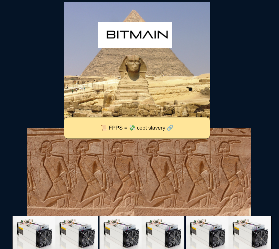
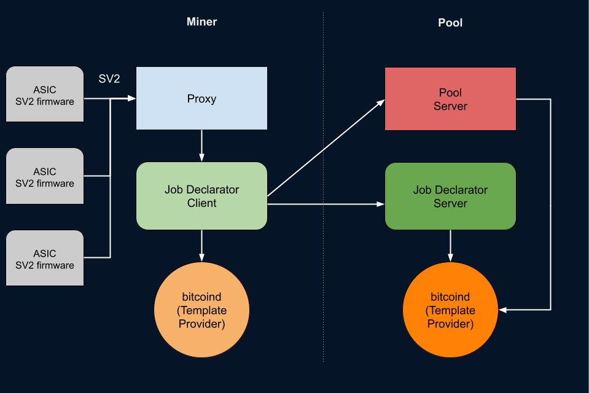

# A step towards mining decentralization.

---

# 🚨 DEFCON 🚨

---

---

---

---

# 🚨 BLOCKSPACE MONOPOLIZATION 🚨

---

---

# SV2 is not a silver bullet

- FPPS is still a cancer.
- Bitmain is still turning into a behemoth.
- AT LEAST they shouldn't be able to monopolize blockspace.

---

---

---

## Stratum V2: Specs

Can be read at `stratumprotocol.org/specification`

Can be improved at `github.com/stratum-mining/sv2-spec`

---

## SV2 Roles

One of the main conceptual entity in SV2 is the notion of **Roles**.

They are involved in data flow and can be labeled as downstream or upstream in relationship to eachother.

---

## Roles: Mining Device

A Mining Device is the machine responsible for hashing.

Usually an ASIC + Control Board in most production scenarios, but also a CPU in some testing and development scenarios.

It is the most downstream role.

---

## Roles: Pool

A Pool is where the hashrate produced by Mining Devies is consumed.

It is the most upstream role.

---

## Roles: Proxy

The Proxy acts as an intermediary between the Mining Devices and the Pool.

It receives mining requests from multiple devices, aggregates their hashrate, and forwards them to the SV2 pool.

It can open group/extended channels with upstream (the Pool) and standard channels with downstream (Mining Devices).

A proxy is also where difficulty adjustments are applied over shares to optimize for bandwidth consumption on miner and pool infrastructure.

---

## Roles: Translator Proxy (tProxy)

The Translator Proxy is responsible for translating the communication between SV1 Mining Devices and an SV2 Pool or Proxy.

It enables legacy SV1-only firmware to interact with SV2-based mining infrastructure, bridging the gap between the older SV1 protocol and SV2.

It can open extended channels with upstream (the Pool or a SV2 Proxy).

---

## Roles: Template Provider (TP)

A custom `bitcoind` node.

Responsible for creation of Block Templates.

---

## Roles: Job Declarator Server (JDS)

Deployed on the Pool infrastructure.

Negotiates Block Templates (on behalf of the Pool) with Job Declarator Clients.

Responsible for allocating the mining job tokens needed by Job Declarator Client to create custom jobs to work on.

---

## Roles: Job Declarator Client (JDC)

Deployed on Miner infrastructure.

Responsible for creating new mining jobs from the templates received by the Template Provider. It negotiates custom jobs with the JDS.

JDC is also responsible for putting in action the Pool-fallback mechanism, automatically switching to backup Pools in case of custom jobs refused by JDS (which is Pool side).

As a solution of last-resort, it is able to switch to Solo Mining until new safe Pools appear in the market.

---

## Stratum Reference Implementation (SRI)

Since 2020, a group of independent developers started to work on a fully open-source implementation of Stratum V2, called SRI (Stratum Reference Implementation).

The purpose of SRI group is to build, beginning from the SV2 specs, a community-based implementation, while discussing and cooperating with as many people of the Bitcoin community as possible.

The Rust codebase can be found at `github.com/stratum-mining/stratum`

---

## SRI: Possible Configurations

Thanks to all these different roles and sub-protocols, SV2 can be used in many different mining contexts.

The SRI working group defined 4 main possible configurations which can be the most probable real use-cases, and they are defined as the following listed.

---

# Config A

---

# Config B

---

# Config C

---

# Config D

---

 
# Q&A

---

# Thank you
